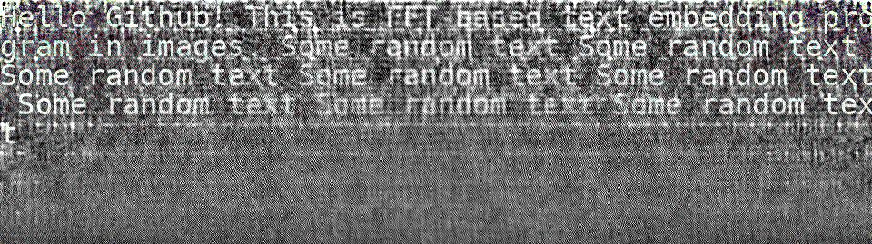

# FFT Image Stganography tool

Программа для встраивания и извлечения текстовой информации в частотную область с помощью быстрого преобразования Фурье (FFT)

## Build

```bash
pip install -r requirements.txt
```

## Usage

## Флаги
- `-E` - режим встраивания (Embedding)
- `-X` - режим извлечения (eXtraction)
- `-i` - изображение для встраивания/извлечения
- `-t` - текст (только для встраивания)
- `-b` - исходное изображение (необходимо для извлечения информации)

### Встраивание

```bash
python3 main.py -E -i <IMAGE_FILE> -t <SOME_TEXT>
```
Если текст большой и трудно копируемый в консоль, можно сначала записать текст в файл, а затем использовать следующую команду

```bash
cat <TEXT_FILE> | xargs -0 python3 main.py -E -i <IMAGE_FILE> -t 
```

После встраивания появится новый файл - изображение-контейнер `res.*` с таким же, как и исходное изображение, форматом

### Извлечение

```bash
python3 main.py -X -i <IMAGE_FILE> -b <BASE_IMAGE_FILE>
```

Извлеченный текст будет находиться в новом файле `text.*` с таким же, как и исходное изображение, форматом

## Пример использования

Исходный файл:


Встравание:
```bash
python3 main.py -E -i input.jpg -t "Hello Github! This is FFT-based text embedding program in images. Some random text Some random text Some random text Some random text Some random text Some random text Some random text Some random text"
```

Изображение-контейнер:


Извлечение:
```bash
python3 main.py -X -i res.jpeg -b input.jpg
```

Извлеченный текст:
